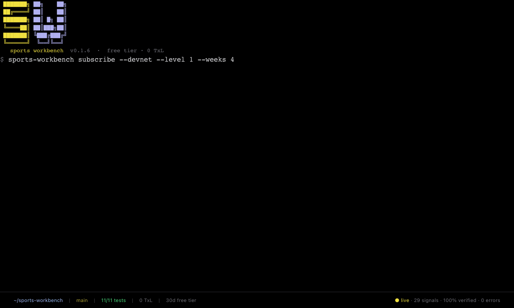

# Sports Workbench

**A verifiable sports trading workbench for the TxLINE / TxODDS World Cup Hackathon.**
Every signal is anchored to a Solana Merkle proof. Free tier, on-chain, open source.

<p align="center">
  
</p>

```
npx -p @srivtx/sports-workbench sports-workbench --version
```

---

## What it is

`sports-workbench` is the **trading tool + agent** for the
[TxODDS World Cup Hackathon](https://earn.superteam.fun/listing/txodds-world-cup-hackathon/)
(Trading Tools &amp; Agents track, $10k first prize, deadline July 19 2026).

It runs against **TxLINE** — the only sports data feed with **cryptographic Merkle proofs
anchored on Solana**. Every odds update, every score event, every fixture change is
committed to an on-chain Merkle root. Anyone can verify that the data the agent acted
on was real, was published at a specific time, and was anchored to the chain.

`sports-workbench` is the first tool to use that capability for backtesting and live
signal generation.

## Quick start

### One-liner (zero install)

```bash
npx -p @srivtx/sports-workbench sports-workbench backtest \
  --strategy sharpDetector \
  --from 2026-06-01 \
  --to 2026-07-10 \
  --threshold 2 \
  --out report.json
```

### One-time on-chain subscribe

The free tier (Service Level 1 or 12, 0 TxL) is gated by an on-chain Solana
subscription. One call, ~0.002 SOL one-time, 30 days of streaming + proofs.

```bash
npx -p @srivtx/sports-workbench sports-workbench subscribe --devnet --level 1 --weeks 4
# → returns { txSig, apiToken, expiresAt, wallet }
# → save the apiToken somewhere safe

export TXLINE_API_TOKEN=<apiToken from above>
```

### Live signal agent

```bash
npx -p @srivtx/sports-workbench sports-workbench signal \
  --strategy sharpDetector \
  --threshold 0.5 \
  --devnet \
  --state ./my-signals.json
```

The agent connects to the free World Cup odds stream, detects every &gt;0.5% shift,
fetches the Merkle proof for each, and persists every verifiable signal to a local
JSON store. Drop the binary into a VM or a Cloudflare Worker and let it run.

### Optional: global install (no sudo)

```bash
curl -fsSL https://sports-workbench.srivtx.xyz/install.sh | bash
sports-workbench --version
```

### Optional: self-heal after EACCES

```bash
npx -p @srivtx/sports-workbench sports-workbench doctor --fix
```

Detects 8 setup issues (Node version, npm prefix, PATH, binary, wallet, token, DNS)
and applies the no-sudo fix automatically. Re-installs the package if needed.

---

## What it does

| # | | |
|---|---|---|
| 01 | **Backtester** | replay any date range through any strategy, with on-chain Merkle proofs for every signal |
| 02 | **Live agent** | stream the free World Cup tier SSE feed, fire on &gt;thresholdPct moves, persist to JSON |
| 03 | **Verifiable Settlement Receipt** | per signal: `MessageId` · `ts` · `merkleRoot` · `subTreeProof` · `dailyBatchRootsPda` |
| 04 | **Drop-in skill** | for `solana-agent-kit` (1.7k stars) and any `npx skills add`-compatible agent |

## Built-in strategies

| Strategy | When it fires |
|---|---|
| `sharpDetector` | Max abs deltaPct across all outcomes &gt; threshold (the official one) |
| `momentum` | Home win prob rises &gt; threshold in the rolling window |
| `meanReversion` | Any outcome moves &gt; threshold (bet on snap-back) |
| `custom` | Bring your own JS strategy |

---

## Verifiable Settlement Receipt

Every signal carries a `Verifiable Settlement Receipt`:

```jsonc
{
  "messageId":      "1835131630:00003:000063-10021-stab",
  "ts":             1782457169278,
  "fixtureId":      17588234,
  "marketType":     "OVERUNDER_PARTICIPANT_GOALS · line=1.5",
  "updateStats":    { "updateCount": 63, "minTimestamp": ..., "maxTimestamp": ... },
  "subTreeProof":   [...5 sibling hashes...],
  "mainTreeProof":  [...12 ancestor hashes...],
  "subTreeRoot":    "0x55c2134ff179629a3d466de181f875a5c6c9d61d7fdbda4fc30ff1e508fc1648",
  "merkleRoot":     "0x7a9f3b…d441a8 (on-chain)",
  "programId":      "6pW64gN1s2uqjHkn1unFeEjAwJkPGHoppGvS715wyP2J",
  "batchRootsPda":  "F2k9…b7vm (epochDay=20367)",
  "verifyCall":     "txoracle::validate_odds · compute=1,400,000"
}
```

Take this to a Solana explorer and re-run the on-chain `validate_odds` instruction.
If the data was real, the call succeeds. If anyone tampered with it, the call fails.

---

## As a solana-agent-kit plugin

```ts
import { SolanaAgentKit, KeypairWallet } from "solana-agent-kit";
import { TxlinePlugin } from "@srivtx/sports-workbench/agent-kit";
import bs58 from "bs58";

const agent = new SolanaAgentKit(
  new KeypairWallet(Keypair.fromSecretKey(bs58.decode(process.env.SOLANA_PRIVATE_KEY!))),
  process.env.SOLANA_RPC_URL!,
  {}
).use(new TxlinePlugin({
  strategy: "sharpDetector",
  thresholdPct: 2,
}));

// Now your agent can do:
const r = await agent.methods.backtestOdds(agent, {
  fromDate: Date.parse("2026-06-01"),
  toDate:   Date.parse("2026-07-10"),
  startingBankroll: 10_000,
  verifyOnChain: true,
});
console.log(r.winRate, r.proofArtifacts.length);
```

## As an MCP-compatible skill

```bash
npx skills add srivtx/sports-workbench
```

## Endpoints used

| Endpoint | Auth | Purpose |
|---|---|---|
| `POST /auth/guest/start` | none | 30-day JWT |
| `POST /api/token/activate` | JWT + wallet signature | exchange on-chain subscribe tx for a 30-day `X-Api-Token` |
| `GET /api/fixtures/snapshot/{epochDay}` | JWT | fixture list |
| `GET /api/odds/snapshot/{fixtureId}` | JWT | historical odds snapshot |
| `GET /api/odds/updates/{epochDay}/{hourOfDay}/{interval}` | JWT | 5-min historical odds |
| `GET /api/odds/validation?messageId=…&ts=…` | JWT | Merkle proof |
| `GET /api/scores/historical/{fixtureId}` | JWT | settle backtest outcomes |
| `GET /api/odds/stream` (SSE) | **JWT + `X-Api-Token`** (both required) | live stream |

The reference example's domain `oracle.txodds.com` is **not in public DNS** from any
network we tested; we use the main `txline.txodds.com` / `txline-dev.txodds.com`
host instead, and pass both auth headers — exactly what the reference example does
against the dead subdomain.

## Free tier

Runs entirely on the TxLINE free World Cup tier (Service Level 1 or 12, both 0 TxL).
SOL cost: **~0.002 SOL one-time** (for the Token-2022 ATA rent + tx fee); valid for
30 days. Mainnet works the same way — drop `--devnet`.

## Hackathon context

- **Track:** Trading Tools + Agents
- **Prize:** 10,000 USDT (1st)
- **Deadline:** July 19, 2026 23:59 UTC
- **Judges:** Yash (SendAI), Abhishek, Pratik
- **Repo:** [github.com/srivtx/sports-workbench](https://github.com/srivtx/sports-workbench)
- **Demo:** [sports-workbench.srivtx.xyz](https://sports-workbench.srivtx.xyz)
- **npm:** [`@srivtx/sports-workbench`](https://www.npmjs.com/package/@srivtx/sports-workbench)
- **Program (devnet):** `6pW64gN1s2uqjHkn1unFeEjAwJkPGHoppGvS715wyP2J`
- **Program (mainnet):** `9ExbZjAapQww1vfcisDmrngPinHTEfpjYRWMunJgcKaA`

## TxLINE feedback

Built into `docs/TXLINE_FEEDBACK.md` — liked, wanted, bugs we hit (the
`oracle.txodds.com` DNS issue, the IDL/binary account mismatch, the
`tweetnacl` ESM import, the `makeBaseUrl` double-`/api`, etc.).

## License

MIT.
